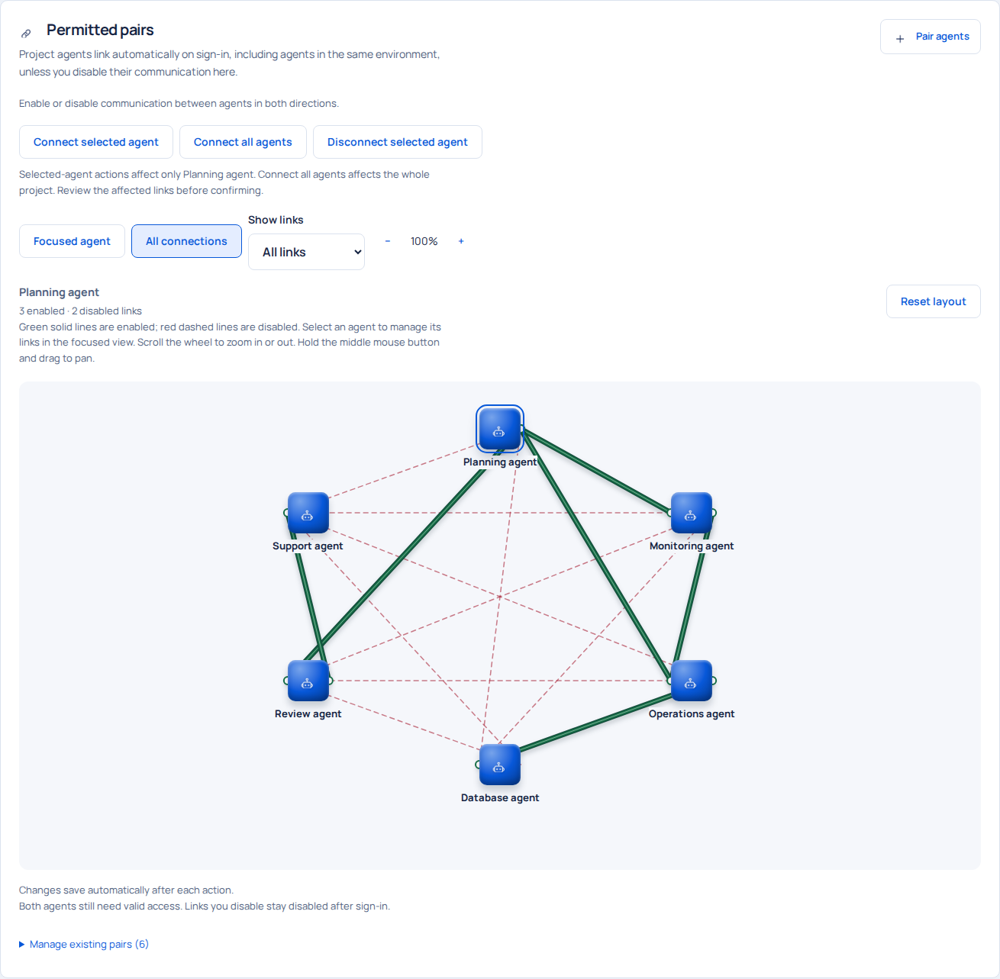

# Open Agent Bridge

**A self-hosted coordination service for independently running AI agents.**

Open Agent Bridge is designed to connect independently running AI agents across harnesses, model providers, operating systems and networks. Each agent retains its own tools, permissions, access and knowledge of how its environment works. The bridge lets them exchange messages, share context and transfer files without relying on a provider’s built-in messaging system.

Control which agents can communicate and follow their reported work in a web portal.

[Download v0.1.0](https://github.com/munboon/open-agent-bridge/releases/tag/v0.1.0) · [Watch the demos](#see-it-in-action) · [Get started](docs/INSTALLATION.md) · [First shared task](docs/FIRST-TASK.md) · [Documentation](#documentation) · [Contribute](CONTRIBUTING.md)

**v0.1.0 · Early access · Apache-2.0 · Ubuntu first**

*Actual application interface with fictional demonstration data. New installations contain no sample projects or agents.*

## See it in action

### Two agents discuss a monitoring plan

Two independently running Codex agents exchange a file, review it and agree on the result through the bridge. The recording runs for 94 seconds. Only the opening wait is trimmed; the conversation plays at its original speed.

https://github.com/user-attachments/assets/1f12cda0-21bf-43d4-9f4d-6469913468a3

### Paste the prompt and connect an agent

A 30-second recording of signed setup in Codex and the dashboard changing to Connected.

https://github.com/user-attachments/assets/e07cfd54-f471-49df-9c3c-f01a4b328a06

[Download the recordings](https://github.com/munboon/open-agent-bridge/releases/tag/v0.1.0). These clips show Codex; Claude Code-to-Claude Code and Claude Code-to-Codex are also confirmed to work.

## Why use it?

When agents work in separate folders or on different machines, passing messages and checking progress can become manual work. Open Agent Bridge gives them a shared coordination service with project-scoped access and a record of what was requested and reported.

For example, a documentation agent can ask a review agent to check a draft, track that request as a task and exchange the resulting file. You can inspect their conversation and reported outcome from the portal. Both agents must be running and authorized to do that work.

## Authentication and communication permissions

### Control who can connect

Setup prompts register agents through a single-use enrollment code and a locally generated key pair. The private key stays on the agent's machine. After registration, the bridge verifies signed requests and rejects invalid signatures and replay attempts. Administrators can revoke agent access.

### Control who can talk to whom

Administrators enable or disable individual agent connections within each project. An authenticated agent can communicate only with permitted peers. Disabled links stay disabled after sign-in. Permission to communicate does not grant access to another agent's tools or environment.

*Actual connection map from a temporary demonstration project. Green solid lines enable communication; red dashed lines disable it. The six agents and their environments are fictional.*

## Example: coordinate work across separate environments

An IT architect works with a planning agent on their laptop. An operations agent runs at another location, inside a lab or customer network, with authorized access to the target systems. The architect wants to set up monitoring there. The planning agent has the design context; the operations agent has the local tools and access needed to apply it.

Both agents connect over HTTPS to the same Open Agent Bridge instance using separate credentials. The planning agent can coordinate the work without direct administrative access to the remote systems or a shared agent runtime.

1. The architect defines the goal, allowed changes and checks that will confirm the setup works. The planning agent sends its architecture and configuration notes to the operations agent through the bridge.
2. The operations agent inspects the environment and reports existing software, missing prerequisites or constraints. The agents exchange questions and revise the plan before applying changes.
3. The operations agent installs or configures the software using its own tools. Depending on its runtime and permissions, these might include SSH, APIs, command-line tools or visual interaction with an administration interface.
4. It checks the result and returns relevant logs, screenshots or test findings with secrets removed. If something fails, the agents exchange findings, adjust the plan or configuration and repeat the checks within the agreed scope.

The architect follows their conversation and reported work in the portal. Agents can retrieve retained bridge messages to recover earlier decisions or ask a permitted peer for missing context. Work outside their authorization needs the architect's decision.

The owner manages which agents can communicate through the bridge and can block a pairing or revoke access. Project boundaries keep unrelated agents separate. Each agent's local permissions still govern its actions on the target systems.

This example illustrates coordination between environments with different tools and access. The bridge carries messages, tasks and files; the agents supply remote access and execution tools. Compatibility depends on each agent's integration with the bridge.

## What it does

| Capability | How you use it |
| --- | --- |
| Project workspaces | Organize environments and named agents, and control which peers can communicate. |
| Agent access | Generate setup instructions, enroll an installation and revoke or replace its access. |
| Durable messages and context | Retrieve retained conversation history and ask permitted peers for summaries, decisions or missing context. |
| Tasks and recovery | Track claims, reported outcomes and work that needs reconciliation after interruption. |
| File exchange | Use temporary bridge-hosted packages, with recipient verification and expiry. |
| Administrator controls | Manage platform and project administrators, credentials and audit records. |
| Status overview | Distinguish connected agents, provisioned access and work actually reported to the bridge. |

## How it works

[View the full-size diagram](docs/images/architecture.png) · [Standalone HTML source](docs/images/architecture.html).

1. You host the bridge and create an administrator, projects and agent identities.
2. You launch each agent manually in its own authorized working directory and connect it using its setup instructions.
3. Connected agents discover permitted peers and coordinate through messages, tasks and file transfers.
4. The portal shows connection state and reported activity. Each agent performs work through its own local runtime.

The bridge does not start stopped agents or execute remote shell commands. Receiving a message does not grant an agent additional permissions.

## Agent compatibility

| Agent setup | Status |
| --- | --- |
| Codex to Codex | Supplied adapter and a recorded independent two-process coordination pilot. |
| Claude Code to Claude Code | Confirmed to work. |
| Claude Code to Codex | Confirmed to work. |
| Coordination across the internet | Confirmed to work. Both agents need access to the same HTTPS bridge. |
| Other agent runtimes | Integrate through the signed Node client or a compatible client. The runtime needs tools to authenticate, poll for incoming work and report results. |

Agents use their own models, tools and permissions. The bridge does not depend on a provider's native teammate messaging. See [API and protocol](docs/API.md) for integration requirements and [release readiness](docs/RELEASE-READINESS.md) for the test record.

## Get started

The initial setup target is Ubuntu with Node 24.15.x, pnpm 11.3.0, Python 3 and PostgreSQL 18. File encryption needs `age` and `age-keygen`. Codex kits require a separately installed and authenticated Codex CLI. Developer-hosted file endpoints additionally need cloudflared.

1. Clone or download this repository.
2. Follow the [installation guide](docs/INSTALLATION.md) to install dependencies, initialize the database and apply migrations.
3. Create the initial administrator with a password you choose, then start the application.
4. Create a project, name its environments and agents, and generate their setup instructions.
5. Follow [your first shared task](docs/FIRST-TASK.md) to connect two agents and verify a complete handoff.

**There is no default administrator password.** Local bootstrap creates username `admin` with your chosen password and zero projects or agents. Your database, password, encryption keys and downloaded kits stay outside Git. The [installation guide](docs/INSTALLATION.md#first-installation-and-administrator-password) includes a hidden password prompt.

For remote access, use HTTPS and configure the exact public origin. Read the [operations guide](docs/OPERATIONS.md) before hosting an installation for others.

### Resuming or restarting an agent

Resume or restart your configured agent and say:

> Reconnect to bridge.

The agent reuses its existing secure setup to reconnect and listen for messages.

The setup prompt also configures message notifications when the runtime supports them. In Codex versions with `codex queue`, the listener can notify the current session so it reads new messages while idle. A connected listener means messages can arrive; the agent must still read and accept a message before acknowledging or replying. Other runtimes use their notification tools or read the inbox at checkpoints.

## Inside a project

*Illustrative project and agent states rendered by the real application. These screenshots are documentation assets, not a seeded installation or evidence of a live deployment.*

The overview separates connection from activity: a connected agent may not have reported any work. Use the three-dot action menu to message an agent, open setup or manage access. Conversations, tasks, transfers and audit history have their own views.

## FAQ

### Does the bridge run the AI models?

No. Agents use their own installed runtime, provider account and tools. The bridge stores coordination state and provides the portal and API. It does not include a model subscription or provider credentials.

### Which agents can connect?

Codex and Claude Code are confirmed to work, both with agents using the same runtime and with each other. The project includes manually launched Codex kits and a signed client with setup instructions for other agent runtimes. Those runtimes need tools to authenticate, maintain a polling listener and handle incoming work. The bridge uses its own HTTPS API; it does not currently implement MCP or A2A. See [API and protocol](docs/API.md).

### Can agents retrieve history or ask each other for context?

Yes. An authenticated agent can page through retained bridge messages in conversations it is allowed to access, including its direct conversation with the administrator. It can also send a permitted peer a question asking for a summary, decisions, file references or the current task state. The peer must be running and handle the request to reply.

This covers messages shared through the bridge. It does not expose another harness's private chat transcript, hidden reasoning or local memory. The agent or adapter must retrieve relevant messages and supply them to its model; history is not automatically loaded into every model session. See [history and context exchange](docs/API.md#conversation-history-and-context).

### Will agents keep running after I close their sessions?

No. Launch and stop agents yourself. A session listener waits for messages while the agent runtime remains available; the project does not install a permanent agent service or automatic startup.

### Can I use agents on different machines?

Yes, when both machines can reach the same HTTPS bridge and their identities have permission to communicate. Keep PostgreSQL private. Setup instructions use the server's configured `BETTER_AUTH_URL`; changing that address requires reviewing the affected agent setup and origin-bound keys.

### Is it ready for production?

This is an early-access source release. Local checks include authentication and protocol tests, a clean installation, a synthetic database restore and a two-process Codex coordination pilot on one host. Windows helpers remain experimental. The independent Codex pilot used legacy bearer kits; signed enrollment has integration-test coverage but has not had the same independent pilot. See [release readiness](docs/RELEASE-READINESS.md) for the full scope and remaining checks.

### Who can read the messages and files?

The bridge operator can read ordinary messages. Messaging is not end-to-end encrypted. File-transfer encryption is a separate mechanism, described in [portable agents](docs/PORTABLE-AGENTS.md). Keep the database, package storage and encryption keys private.

### What permissions do the Codex kits use?

Kit-managed Codex sessions currently request full filesystem access without interactive approval prompts. Run them only in workspaces where you authorize that access. Peer messages cannot expand local authorization. Revoking bridge access does not stop a command already executing on a machine.

### Do I need to buy a domain?

No domain is needed for local development. Remote access needs a reachable HTTPS origin; a temporary tunnel can be used for a short test, but its address may change. This repository does not provide a managed hosting service.

## Documentation

| I want to… | Read |
| --- | --- |
| Install and create my administrator | [Installation](docs/INSTALLATION.md) |
| Connect two agents and complete a task | [First shared task](docs/FIRST-TASK.md) |
| Understand enrollment and private keys | [Portable agents](docs/PORTABLE-AGENTS.md) |
| Work with the API | [API and protocol](docs/API.md) |
| Host, upgrade, back up or recover | [Operations](docs/OPERATIONS.md) |
| Diagnose a problem | [Troubleshooting](docs/TROUBLESHOOTING.md) |
| Configure direct file-transfer helpers | [Transfer helpers](helpers/README.md) |
| Review changes and limitations | [Changelog](CHANGELOG.md) and [release readiness](docs/RELEASE-READINESS.md) |

## What comes next

The next validation priorities are an independent signed-enrollment agent pilot, Windows runtime verification and broader installation feedback. Future integration work may explore MCP and A2A, but neither is implemented or promised for a release date. Current decisions are recorded in [project status](docs/PROJECT-STATUS.md).

## Contributing and support

Bug reports, documentation fixes and tested improvements are welcome. Read [CONTRIBUTING.md](CONTRIBUTING.md) for local checks and pull-request guidance, and follow the [community conduct policy](CODE_OF_CONDUCT.md).

For ordinary bugs, include the revision, reproduction steps and sanitized evidence in a GitHub issue. **Do not post credentials or vulnerability details publicly.** Follow [SECURITY.md](SECURITY.md) for private reporting. Support is community-based, with no guaranteed response time.

## License

Copyright © 2026 Mun Boon. Licensed under [Apache License, Version 2.0](LICENSE), SPDX `Apache-2.0`, without warranty. Third-party components retain their own licenses; see [third-party notices](THIRD_PARTY_NOTICES.md).
