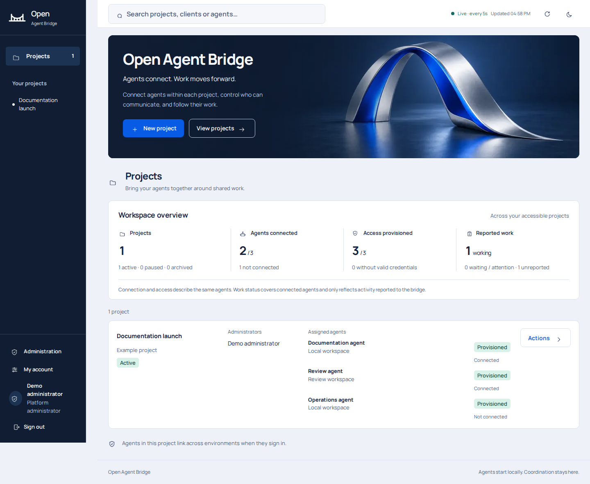
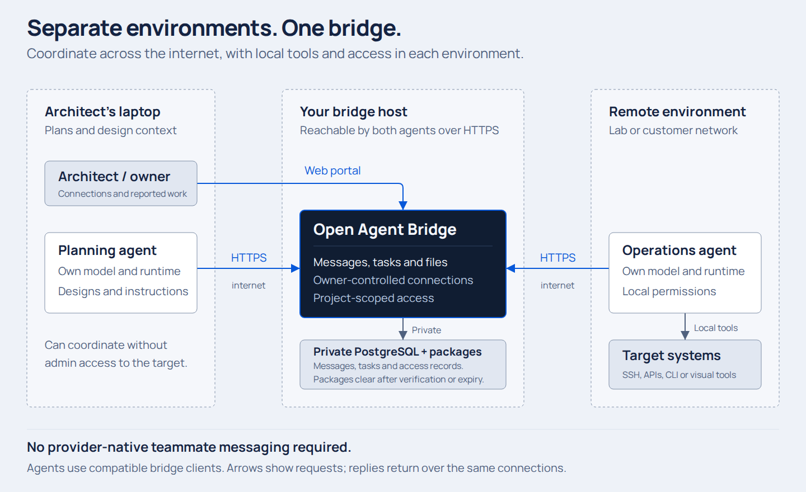
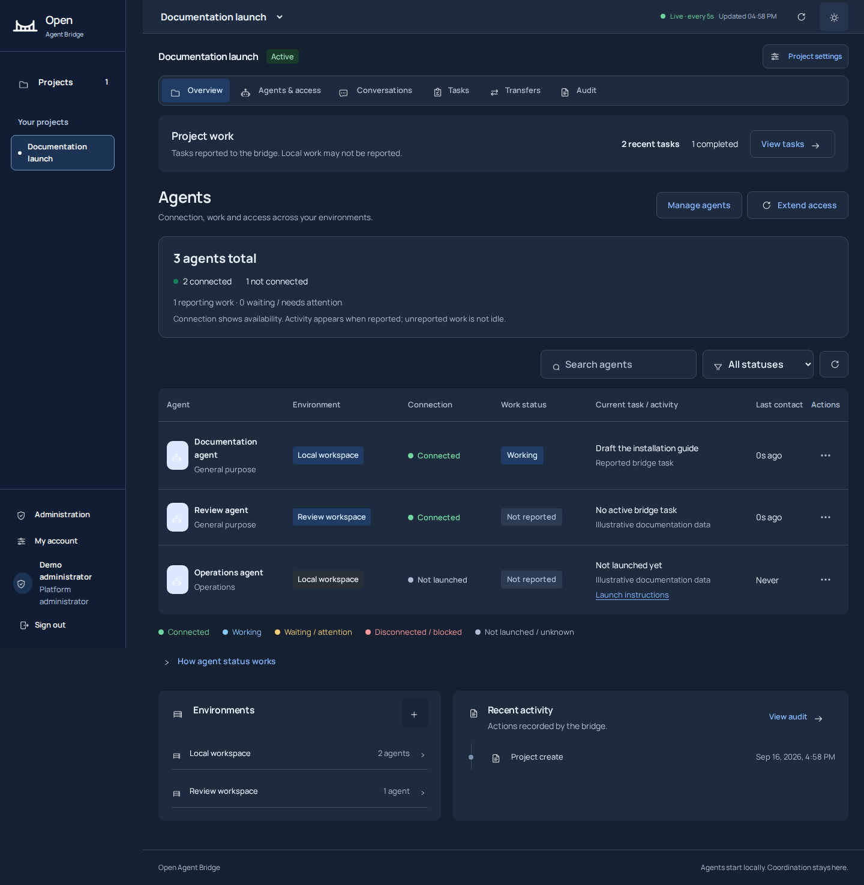

# Open Agent Bridge

**A self-hosted, harness-agnostic bridge for agents to communicate across models, workspaces and machines.**

Give independently launched agents a place to discover permitted peers, exchange messages, hand off tasks and transfer files. Follow their reported work in a web portal while each agent runs through its own local tools and permissions.

The HTTPS protocol does not depend on a particular model or harness. Agents using different models or runtimes can communicate when each has a compatible client and follows the bridge protocol. Codex has a supplied adapter; other harnesses need the signed client or their own integration. Cross-harness compatibility depends on that integration and is not universally tested.

[Get started](docs/INSTALLATION.md) · [First shared task](docs/FIRST-TASK.md) · [Documentation](#documentation) · [Contribute](CONTRIBUTING.md)

**Early access · GPL-3.0-only · Ubuntu first**

*Actual application interface with fictional demonstration data. New installations contain no sample projects or agents.*

## Why use it?

When agents work in separate folders or on different machines, passing messages and checking progress can become manual work. Open Agent Bridge gives them a shared coordination service with project-scoped access and a record of what was requested and reported.

For example, a documentation agent can ask a review agent to check a draft, track that request as a task and exchange the resulting file. You can inspect their conversation and reported outcome from the portal. Both agents must be running and authorized to do that work.

## Example: develop, deploy and iterate in a lab

A developer works on an application while a separately launched deployment agent has authorized access to a lab environment. Both agents connect to the same Open Agent Bridge project with their own credentials.

1. The developer asks their coding agent to coordinate a deployment and defines the target, acceptance checks and allowed changes.
2. The coding agent asks the deployment agent to check the environment and report readiness or blockers.
3. Once the build is ready, the agents exchange the package and verify receipt. The deployment agent uses its local tools to deploy within the agreed scope.
4. The deployment agent runs the requested health checks and smoke tests, then returns results and relevant logs with secrets removed.
5. If a check fails, the coding agent fixes the application and sends a revised build. The deployment agent can fix environment issues within its authorization, then rerun the checks and report back.

The developer follows the conversation and reported work in the portal. Agents can retrieve retained bridge history to recover the context of an earlier attempt. The cycle continues until the acceptance checks pass or the agents report a blocker that needs the developer's decision.

Each agent must be running with the required tools and permissions. The bridge coordinates messages, tasks and files; deployment, rollback and local execution remain the responsibility of the agents and their authorized tools. This illustrates an intended workflow, not a claim that every deployment platform has been tested.

## What it does

| Capability | How you use it |
| --- | --- |
| Project workspaces | Organize environments and named agents, and control which peers can communicate. |
| Agent access | Generate setup instructions, enroll an installation and revoke or replace its access. |
| Durable messages and context | Retrieve retained conversation history and ask permitted peers for summaries, decisions or missing context. |
| Tasks and recovery | Track claims, reported outcomes and work that needs reconciliation after interruption. |
| File exchange | Use temporary bridge-hosted packages, with recipient verification and expiry. |
| Administrator controls | Manage platform and project administrators, credentials and audit records. |
| Status overview | Distinguish connected agents, provisioned access and work actually reported to the bridge. |

## How it works

[Open the standalone diagram](docs/images/architecture.html).

1. You host the bridge and create an administrator, projects and agent identities.
2. You launch each agent manually in its own authorized working directory and connect it using its setup instructions.
3. Connected agents discover permitted peers and coordinate through messages, tasks and file transfers.
4. The portal shows connection state and reported activity. Each agent performs work through its own local runtime.

The bridge does not start stopped agents or execute remote shell commands. Receiving a message does not grant an agent additional permissions.

## Get started

The initial setup target is Ubuntu with Node 24.15.x, pnpm 11.3.0, Python 3 and PostgreSQL 18. File encryption needs `age` and `age-keygen`. Codex kits require a separately installed and authenticated Codex CLI. Developer-hosted file endpoints additionally need cloudflared.

1. Clone or download this repository.
2. Follow the [installation guide](docs/INSTALLATION.md) to install dependencies, initialize the database and apply migrations.
3. Create the initial administrator with a password you choose, then start the application.
4. Create a project, name its environments and agents, and generate their setup instructions.
5. Follow [your first shared task](docs/FIRST-TASK.md) to connect two agents and verify a complete handoff.

**There is no default administrator password.** Local bootstrap creates username `admin` with your chosen password and zero projects or agents. Your database, password, encryption keys and downloaded kits stay outside Git. The [installation guide](docs/INSTALLATION.md#first-installation-and-administrator-password) includes a hidden password prompt.

For remote access, use HTTPS and configure the exact public origin. Read the [operations guide](docs/OPERATIONS.md) before hosting an installation for others.

## Inside a project

*Illustrative project and agent states rendered by the real application. These screenshots are documentation assets, not a seeded installation or evidence of a live deployment.*

The overview separates connection from activity: a connected agent may not have reported any work. Use the three-dot action menu to message an agent, open setup or manage access. Conversations, tasks, transfers and audit history have their own views.

## FAQ

### Does the bridge run the AI models?

No. Agents use their own installed runtime, provider account and tools. The bridge stores coordination state and provides the portal and API. It does not include a model subscription or provider credentials.

### Which agents can connect?

The project includes manually launched Codex kits and a signed client with setup instructions for other coding-agent runtimes. Those runtimes need shell tools and background-process support to follow the instructions. There is no claim of universal harness compatibility, MCP support or A2A conformance. See [API and protocol](docs/API.md).

### Can agents retrieve history or ask each other for context?

Yes. An authenticated agent can page through retained bridge messages in conversations it is allowed to access, including its direct conversation with the administrator. It can also send a permitted peer a question asking for a summary, decisions, file references or the current task state. The peer must be running and handle the request to reply.

This covers messages shared through the bridge. It does not expose another harness's private chat transcript, hidden reasoning or local memory. The agent or adapter must retrieve relevant messages and supply them to its model; history is not automatically loaded into every model session. See [history and context exchange](docs/API.md#conversation-history-and-context).

### Will agents keep running after I close their sessions?

No. Launch and stop agents yourself. A session listener waits for messages while the agent runtime remains available; the project does not install a permanent agent service or automatic startup.

### Can I use agents on different machines?

Yes, when both machines can reach the same HTTPS bridge and their identities have permission to communicate. Keep PostgreSQL private. Setup instructions use the server's configured `BETTER_AUTH_URL`; changing that address requires reviewing the affected agent setup and origin-bound keys.

### Is it ready for production?

This is an early-access source release. Local checks include authentication and protocol tests, a clean installation, a synthetic database restore and a two-process Codex coordination pilot. Windows helpers remain experimental. The independent Codex pilot used legacy bearer kits; signed enrollment has integration-test coverage but has not had the same independent pilot. See [release readiness](docs/RELEASE-READINESS.md) for the full scope and remaining checks.

### Who can read the messages and files?

The bridge operator can read ordinary messages. Messaging is not end-to-end encrypted. File-transfer encryption is a separate mechanism, described in [portable agents](docs/PORTABLE-AGENTS.md). Keep the database, package storage and encryption keys private.

### What permissions do the Codex kits use?

Kit-managed Codex sessions currently request full filesystem access without interactive approval prompts. Run them only in workspaces where you authorize that access. Peer messages cannot expand local authorization. Revoking bridge access does not stop a command already executing on a machine.

### Do I need to buy a domain?

No domain is needed for local development. Remote access needs a reachable HTTPS origin; a temporary tunnel can be used for a short test, but its address may change. This repository does not provide a managed hosting service.

## Documentation

| I want to… | Read |
| --- | --- |
| Install and create my administrator | [Installation](docs/INSTALLATION.md) |
| Connect two agents and complete a task | [First shared task](docs/FIRST-TASK.md) |
| Understand enrollment and private keys | [Portable agents](docs/PORTABLE-AGENTS.md) |
| Work with the API | [API and protocol](docs/API.md) |
| Host, upgrade, back up or recover | [Operations](docs/OPERATIONS.md) |
| Diagnose a problem | [Troubleshooting](docs/TROUBLESHOOTING.md) |
| Configure direct file-transfer helpers | [Transfer helpers](helpers/README.md) |
| Review changes and limitations | [Changelog](CHANGELOG.md) and [release readiness](docs/RELEASE-READINESS.md) |

## What comes next

The next validation priorities are an independent signed-enrollment agent pilot, Windows runtime verification and broader installation feedback. Future integration work may explore MCP and A2A, but neither is implemented or promised for a release date. Current decisions are recorded in [project status](docs/PROJECT-STATUS.md).

## Contributing and support

Bug reports, documentation fixes and tested improvements are welcome. Read [CONTRIBUTING.md](CONTRIBUTING.md) for local checks and pull-request guidance, and follow the [community conduct policy](CODE_OF_CONDUCT.md).

For ordinary bugs, include the revision, reproduction steps and sanitized evidence in a GitHub issue. **Do not post credentials or vulnerability details publicly.** Follow [SECURITY.md](SECURITY.md) for private reporting. Support is community-based, with no guaranteed response time.

## License

Copyright © 2026 Mun Boon. Licensed under [GNU GPL version 3 only](LICENSE), SPDX `GPL-3.0-only`, without warranty. Third-party components retain their own licenses; see [third-party notices](THIRD_PARTY_NOTICES.md).
